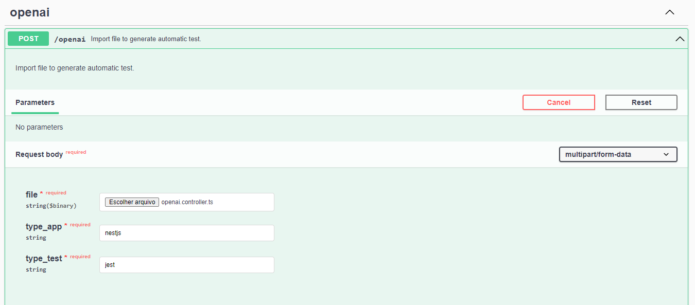
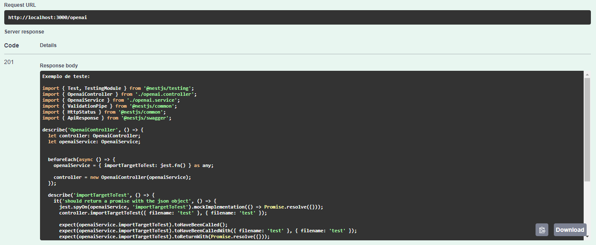

<p align="center">
  <a href="http://nestjs.com/" target="blank"></a>
</p>

[circleci-image]: https://img.shields.io/circleci/build/github/nestjs/nest/master?token=abc123def456
[circleci-url]: https://circleci.com/gh/nestjs/nest


<h1 align="center">API Nestjs with Chatgpt</h1>
<!-- <p align="center">
<a href="https://www.npmjs.com/~nestjscore" target="_blank"></a>
</p> -->


## Description

An api with chatgpt integration in order to create tests.

## Example usage

<p align="center">
  
  
</p>

## Installation

```bash
$ npm install
```

## Running the app

```bash
# development
$ npm run start

# watch mode
$ npm run start:dev

# production mode
$ npm run start:prod
```

## Test

```bash
# unit tests
$ npm run test

# e2e tests
$ npm run test:e2e

# test coverage
$ npm run test:cov
```


## Stay in touch

- Author - [Eduardo Moritz](https://kamilmysliwiec.com)
- Linkedin - [https://www.linkedin.com](https://www.linkedin.com/in/eduardo-moritz-5298a0118/)

